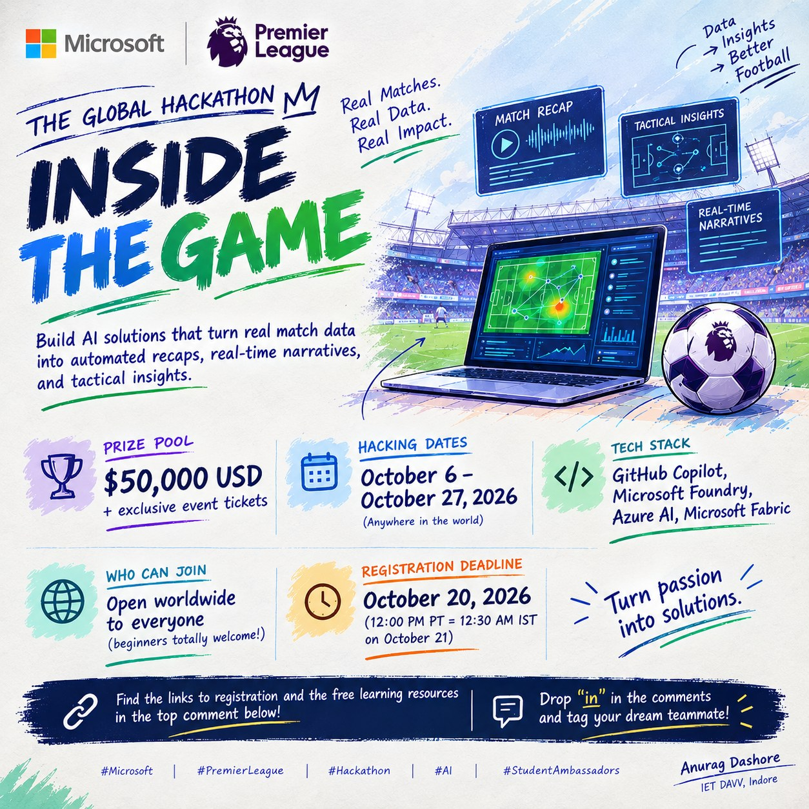

# Inside the Game: Developer Hackathon

Microsoft + Premier League.

*Unofficial community poster by Anurag Dashore.*

## Overview

Microsoft and the Premier League invite developers worldwide to join Inside the Game: Developer Hackathon and build AI-powered solutions that transform synthetic, football-realistic data into explainable match intelligence, real-time narratives, and automated match recaps for studio, broadcast, or streaming scenarios.

## Key dates

- **Registration deadline:** October 20, 2026, 12:00 PM Pacific Time (12:30 AM IST on October 21)
- **Hacking period:** October 6 to October 27, 2026, 11:59 PM Pacific Time (12:29 PM IST on October 28)

Create and submit an AI solution to climb the leaderboard and compete for a share of $50,000 USD in cash prizes, event tickets, and more.

## What to build

The strongest submissions will leverage GitHub, GitHub Copilot, Microsoft Foundry, Azure AI Services, Microsoft Fabric and other Azure Database and Analytics services, and the Azure cloud-native services to create AI-powered applications and agents that:

- Analyze match events in real time
- Generate stories, highlights, and recaps
- Explain key moments and tactical patterns
- Expand datasets for AI and analytics
- Deliver insights for fans around the world in multiple languages
- Deliver personalized experiences for studios, streaming platforms, and fans

# Resources

## Register and join live sessions

- **[Register for the hackathon](https://events.microsoft.com/flow/microsoft/plmshackathon/registration/page/landing?wt.mc_id=studentamb_654871)**: Free to join. Registration closes October 20, 2026, 12:00 PM Pacific Time.
- **[Live Microsoft Reactor sessions](https://developer.microsoft.com/reactor/series/S-1709/?wt.mc_id=studentamb_654871)**: Technical guidance and inspiration from live sessions for this hackathon.
- **[Free Azure credits for students](https://azure.microsoft.com/free/students?wt.mc_id=studentamb_654871)**: Azure for Students, so you can build and test on Azure.
- **[Azure free services (general)](https://azure.microsoft.com/pricing/free-services?sortBy=newest-oldest&wt.mc_id=studentamb_654871)**: Azure free services list: services free for your first 12 months, plus 65+ always-free services. Great if you aren't eligible for the student tier.

## Learn: free training by topic

- **[Microsoft Foundry](https://learn.microsoft.com/training/azure/ai-foundry?wt.mc_id=studentamb_654871)**: Start here: the Foundry portal, SDKs, agents and evaluation.
- **[Build AI apps and agents on Azure](https://learn.microsoft.com/training/paths/get-started-ai-apps-agents/?wt.mc_id=studentamb_654871)**: Generative AI and agents in Foundry. Useful for generating stories, highlights and recaps.
- **[Build AI agents with Foundry Agent Service](https://learn.microsoft.com/training/paths/develop-ai-agents-azure/?wt.mc_id=studentamb_654871)**: Agents, MCP tools and multi-agent solutions. Useful for personalized experiences.
- **[Real-Time Intelligence in Microsoft Fabric](https://learn.microsoft.com/training/modules/get-started-kusto-fabric?wt.mc_id=studentamb_654871)**: Ingest, query and visualize streams of events. Useful for analyzing match events in real time.
- **[Translate text and speech](https://learn.microsoft.com/training/modules/translate-text-speech/?wt.mc_id=studentamb_654871)**: Azure Translator and Speech in Foundry Tools. Useful for delivering insights in multiple languages.
- **[Get started with GitHub Copilot](https://learn.microsoft.com/training/modules/get-started-github-copilot?wt.mc_id=studentamb_654871)**: Install and use the Copilot extensions in Visual Studio Code.

## Blogs and docs

- **[Microsoft Foundry blog](https://devblogs.microsoft.com/foundry/?wt.mc_id=studentamb_654871)**: Latest updates on building and running agents with Foundry.
- **[Fabric Real-Time Intelligence blog](https://blog.fabric.microsoft.com/blog/category/real-time-intelligence?wt.mc_id=studentamb_654871)**: Posts on Eventstream, Eventhouse and real-time dashboards.
- **[GitHub Copilot in VS Code](https://code.visualstudio.com/docs/copilot/overview?wt.mc_id=studentamb_654871)**: Official guide to completions, chat and agent features in VS Code.
